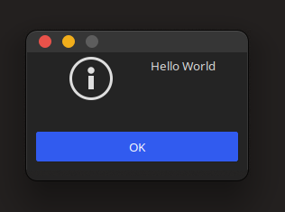

<div align="center">
    
</div>

# GTK-UI 🎨

**GTK-UI** is a library for creating an easy interfaces in C language using low level GTK library.

## Table of contents

* [Instalation](#Instalation)
    * [Manual](#Manual)
        * [Manual](#Manual)
        * [Build from sources](#Build-from-sources)
        * [Install .deb (Ubuntu, Mint, Debian etc.)](#Install-deb-Ubuntu-Mint-Debian-etc)
* [Documentation](#Documentation)
    * [Hello world](#Hello-world)
    * [Creating a window](#Creating-a-window)
    * [Creating a label](#Creating-a-label)
    * [Creating a button](#Creating-a-button)
    * [Creating a box](#Creating-a-box)
    * [Creating a stack](#Creating-a-stack)
    * [Creating an image](#Creating-an-image)
    * [Creating a grid](#Creating-a-grid)
    * [Attaching event callbacks](#Attaching-event-callbacks)
    * [Load CSS](#Load-CSS)
    * [Set CSS ID](#Set-CSS-ID)
    * [Manipulate with CSS class names](#Manipulate-with-CSS-class-names)
    * [Message box](-Message-box)

## Instalation

### Manual
Just grap `gtkui.h` and `gtkui.c` files and put them in your project.
Include in the following way:

```c
#include "gtkui.h"
```

And compile with:

```bash
gcc `pkg-config --cflags gtk+-3.0` main.c gtkui.c `pkg-config --libs gtk+-3.0`
```

### Build from sources
1. Clone this repo
2. run `make`
3. run `sudo make install`

Include in the following way:

```c
#include <gtkui.h>
```

And compile with:

```bash
gcc `pkg-config --cflags gtkui` main.c `pkg-config --libs gtkui`
```

### Install .deb (Ubuntu, Mint, Debian etc.)
Grab newest release from here https://github.com/Ph0enixKM/GTK-UI/releases

Include in the following way:

```c
#include <gtkui.h>
```

And compile with:

```bash
gcc `pkg-config --cflags gtkui` main.c `pkg-config --libs gtkui`
```


## Documentation

### Hello world

The first step of learning how GTK-UI works is to create a Hello World program. As you can see it looks pretty much similar to the vanilla GTK version.

```c
#include <gtkui.h>

int main(int argc, char* argv[]) {
    gtk_init(&argc, &argv);
    // Here is our GTK-UI function
    UIPrint("Hello World");
    gtk_main();
}
```

> Keep in mind that **GTK-UI** works in synergy with **GTK** and is IS NOT supposed to replace the usage of GTK library.

<div align="center">
    
</div>

- ### Creating a window

```c
UI window = UICreateWindow("Title", (WindowConfig) {
    .width = 1020,      // Width of the window
    .height = 720,      // Height of the window
    .center = true,     // Shall the window be centered?
    .resizable = true,  // Shall the window be resizable?
    .border = 10,       // Border size of the window
    .exit = true        // Shall the program end on exit?
});
```

You do not have to show the window - it's set to be **visible** by default - the same thing applies to all components made by GTK-UI

Convenient macro for creating window:
```c
UI window = UIWindow("Title", .width = 1020, .height = 720, .exit = true);
```

- ### Creating a label

```c
UI label = UICreateLabel("Some text here");
UIAppend(window, label);
// Optionally we can also use
UIRemove(window, label);
// We can show and hide elements as well
UIHide(label);
UIShow(label);
```

- ### Creating a button

```c
UI button = UICreateButton("Click me!");
UIAppend(window, button);
```

- ### Creating a box

```c
UI boxh = UICreateVBox(); // Horizontal box
UI boxv = UICreateHBox(); // Vertical box
// Set spacing of a box
UISetBoxSpacing(boxh, 10);
```

- ### Creating a stack

    - Without switcher:

    ```c
    UI stack = UICreateStack();
    UI label1 = UICreateLabel("item one");
    UI label2 = UICreateLabel("item one");
    UIStackAdd(stack, label1, "first");
    UIStackAdd(stack, label2, "second");
    UIStackVisibleName(stack, "second");
    ```

    - With switcher:

    ```c
    UI stack = UICreateStack();
    UI switcher = UICreateStackSwitcher(stack);
    UI label1 = UICreateLabel("item one");
    UI label2 = UICreateLabel("item one");
    UIStackAddTitled(stack, label1, "first", "First tab");
    UIStackAddTitled(stack, label2, "second", "Second tab");
    ```

- ### Creating an image

```c
UI img = UICreateImage("path/to/image.png");
```

You can also load up image file and then reuse it's data for later usage. This way you can reuse the image much faster and use less resources.

```c
GdkPixbuf* imgData = UILoadImageData("path/to/image.png");
UI img = UILoadImage(imgData);
UIAppend(window, img);
```

- ### Creating a grid

```c
UI grid = UICreateGrid(true); // Homogeneous?
UIAppend(window, grid);
// You can set spacing of the grid
UISetGridColumnSpacing(grid, 15);
UISetGridRowSpacing(grid, 10);
// Let's add an image to our grid
UIAttach(grid, img, 0, 0, 1, 1);
// Numerical values indicate x, y, width, height
```

- ### Creating an entry

```c
UI entry = UICreateEntry("placeholder");
UIAppend(window, entry);
// Setting and getting values
UISetEntryValue(entry, "some value");
const char* value = UIGetEntryValue(entry);
// You can also quickly check the 
// length in characters of the values
unsigned length = UIEntryLength(entry);
```

- ### Creating a slider

```c
UI slider = UICreateSlider(1, 10, 1); // min, max, step
UIAppend(window, slider);
// Setting and getting values
UISetSliderValue(entry, 7);
double value = UIGetSliderValue(entry);
```

- ### Creating a scroll view

```c
UI scroll = UICreateScrollView(false, true); // scrollx, scrolly
UIAppend(window, scroll);
```
Scroll view is a widget that can take up to one element at a time. 
It is recommended to use a box or grid in order to store all the elements in the view.

- ### Attaching event callbacks

```c
UI window = UICreateWindow("Title", options);
UIEvent(window, "destroyed", qtk_main_quit, NULL);
```

- ### Load CSS
  
  - From file
    
    ```c
    UILoadCSS("path/to/style.css");
    ```
  
  - From string
    
    ```c
    UILoadCSSData(
        ".box {"
        "background: red;"
        "}"
    );
    ```

- ### Set CSS ID
  
  ```c
  UISetID(widget, "container");
  ```

- ### Manipulate with CSS class names
  
  ```c
  UIAddClass(widget, "btn");
  bool has = UIHasClass(widget, "btn");
  UIRemoveClass(widget, "btn");
  ```

- ### Message box
  
  ```c
  UIError("Oops!");
  UIWarning("Are you sure?");
  UIPrint("Debug information");
  ```
  
  
